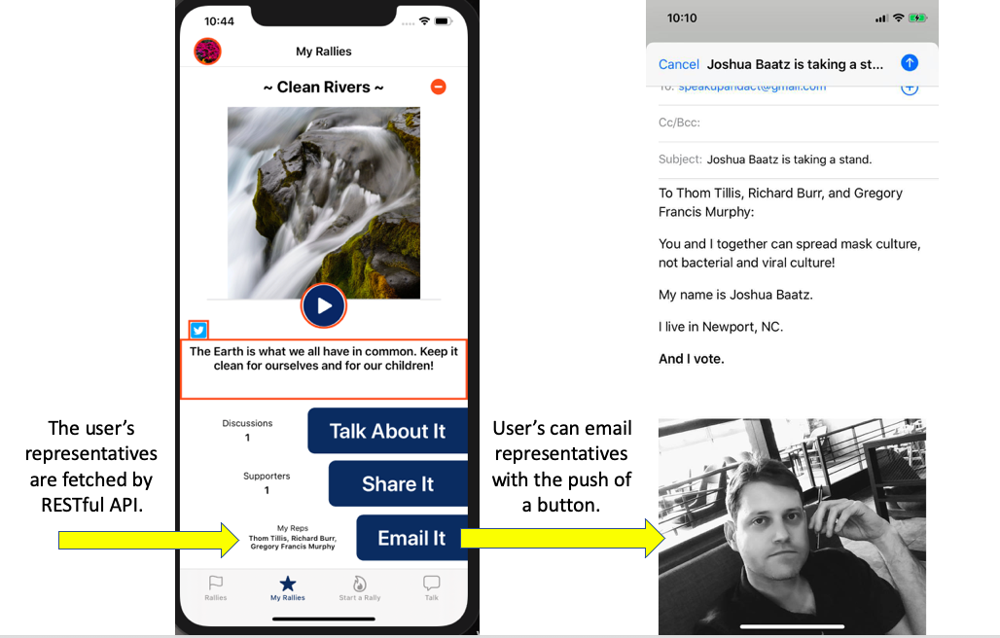
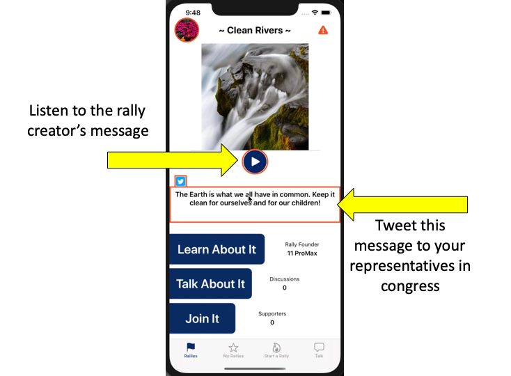
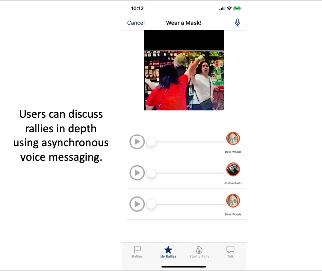

# Joshua Baatz - Portfolio

## iRally
Political Activism App

### •	iRally is a social media app connecting citizens with their representatives in congress, as well as offering a space for users to discuss current events and possible courses of action.

  

### •	Representatives are assigned based on the user’s address, allowing them to email their reps with ease.

### •	Users can also connect with their representatives using Twitter.

### •	Users can record their own voice messages for discussions with other users.

  

  

